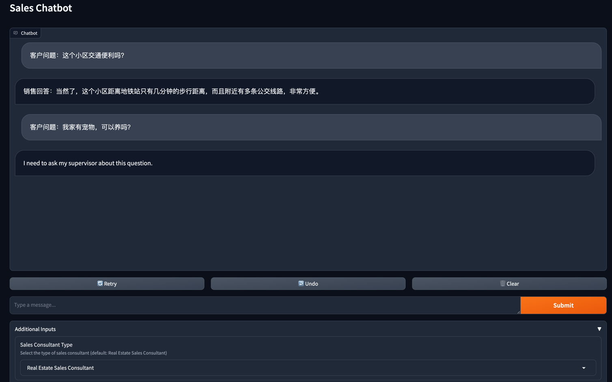

## Setting up the Runtime Environment
This project is developed using Python v3.10. The complete Python dependency packages can be found in requirements.txt.

**Here are the detailed installation instructions (using Ubuntu operating system as an example):**

### Installing Miniconda
```shell
mkdir -p ~/miniconda3
wget https://repo.anaconda.com/miniconda/Miniconda3-latest-Linux-x86_64.sh -O ~/miniconda3/miniconda.sh
bash ~/miniconda3/miniconda.sh -b -u -p ~/miniconda3
rm -rf ~/miniconda3/miniconda.sh
```
After the installation is complete, it is recommended to create a new Python virtual environment named `chatbot`.

```shell
conda create -n chatbot python=3.10
```

### Activate the environment
```shell
conda activate chatbot 
```
You will need to activate this environment every time you use it.

### Installing Python Dependency Packages
#### Run the following command in the homework directory
```shell
pip install -r requirements.txt
```
### Configuring OpenAI API Key
Depending on the command-line tool you are using, configure the OPENAI_API_KEY environment variable in ~/.bashrc or ~/.zshrc:

```shell
export OPENAI_API_KEY="xxxx"
```

### Running the Project

```shell
python multiple_types_sales_chatbot.py --enable_chat=False
```
|Parameter	|Description|
|-------------|------------------------------------------------------------------------|
|enable_chat|	Whether to enable chatgpt conversation. If encountering uncertain questions, choose to answer with LLM (True) or pre-set responses (False). Default is False.|
###  Successful Startup
```shell
/opt/miniconda3/envs/langchain/lib/python3.10/site-packages/langchain/vectorstores/__init__.py:35: LangChainDeprecationWarning: Importing vector stores from langchain is deprecated. Importing from langchain will no longer be supported as of langchain==0.2.0. Please import from langchain-community instead:

`from langchain_community.vectorstores import FAISS`.

To install langchain-community run `pip install -U langchain-community`.
  warnings.warn(
Running on local URL:  http://0.0.0.0:7860
Running on public URL: https://b711648c551d7b5aaa.gradio.live

This share link expires in 72 hours. For free permanent hosting and GPU upgrades, run `gradio deploy` from Terminal to deploy to Spaces (https://huggingface.co/spaces)
```
If you see Running on local URL: http://0.0.0.0:7860 and Running on public URL: https://b711648c551d7b5aaa.gradio.live, it means the startup was successful. Please enter any of the provided URLs in a web browser to access.
###  Page


## License
This project is licensed under the terms of the Apache-2.0 license. See the LICENSE file for more details.